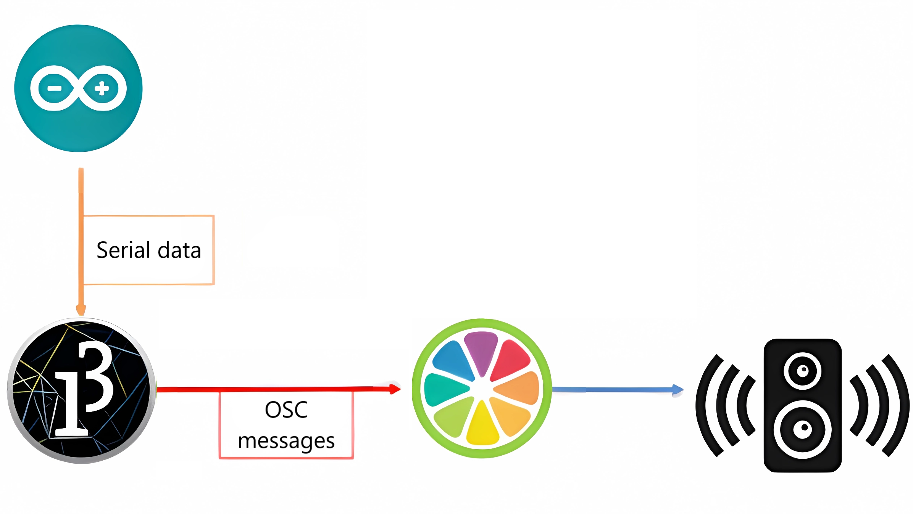
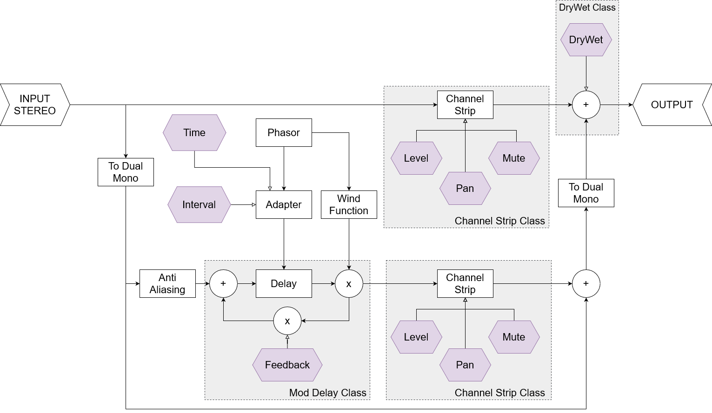

# CMLS HW3 - Design and implementation of a Computer Music System - Kinetic Harmonizer
The **JUCE** plugin we've developed for the Interaction Design project is **Kinetic Harmonizer**, a delay-line harmonizer controlled by the motion captured by an accelerometer, communicated to the software through Arduino and Processing (using respectively Serial communication and Open Sound Control messages).  

  

 
These connections are necessary in order to implement the interactive part of this project.

  

  

 

# About
**Kinetic Harmonizer** is an audio effect plugin that allows the user to add a pitchshifted replica of the input audio to the signal. The pitchshift is determined by the LFO-controlled delay time the signal is processed by.

The user is able to customize the parameters of the harmonizer through motion, which is captured by an accelerometer. In paricular the sensor we've used for this project is the analog MMA7361 Triple-Axis Accelerometer by Freescale. The analog signal is then converted to digital by the Arduino UNO in order to prepare it for processing by the plugin.

This is the **GUI** of the effect we've developed:

  

  
The following block diagram shows the logical structure of the implementation of the effect in more detail:  

  

The main parameters of the plugin are:

+ **Main Controls**: 
  - *Semitones*: the amount of cents the pitch of the delayed signal will be shifted by
  - *Delay*: controls how long the delay time of the wet signal is in relation to the input signal
  - *Feedback*: determines the amount of signal that is fed back into the delay line

## Interactive Control
The accelerometer, with its three sensors, can send three distinct values in real times to control just as many parameters in the plugin:

+ the **X Coordinate** controls the semitone shift
+ the **Y Coordinate** controls the delay time
+ the **Z Coordinate** controls the feedback reintroduced in the delay line
